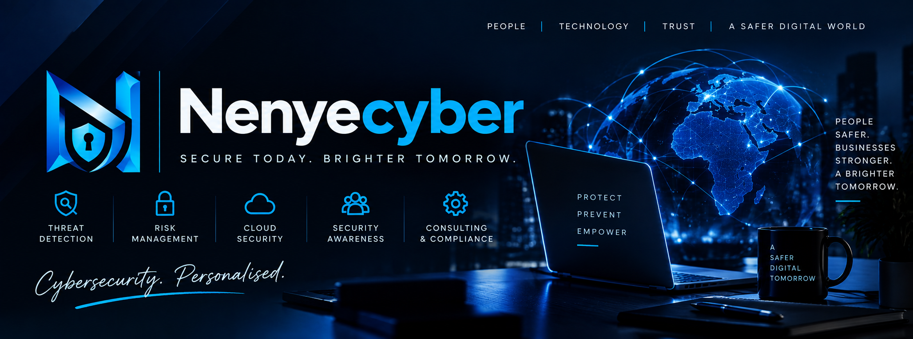

<!-- =========================================================
                     PROFILE BANNER
========================================================= -->

<p align="center">
  
</p>

<!-- =========================================================
                  TYPING ANIMATION
========================================================= -->

<p align="center">
  
</p>

<!-- =========================================================
                     INTRODUCTION
========================================================= -->

<h1 align="center">👩🏽‍💻 Nenyecyber</h1>

<p align="center">
  <strong>Cybersecurity Analyst in Training | Ethical Hacking | Python | Linux | Web Security</strong>
</p>

<p align="center">
  
</p>

---

## 👩🏽‍💻 About Me

I'm a technology enthusiast passionate about **Cybersecurity, Ethical Hacking, Programming, and Digital Education**.

I am focused on developing practical cybersecurity skills, building security-focused projects, and helping beginners understand technology through hands-on learning.

I believe that **technology education should be accessible and practical**, especially for young people looking to build sustainable careers in the digital economy.

### 🔎 Areas of Specialization

<p align="center">
  
</p>

<p align="center">
  🔐 Cybersecurity & Ethical Hacking
  &nbsp; • &nbsp;
  🛡️ Security Analysis
  &nbsp; • &nbsp;
  🐍 Python Programming
</p>

<p align="center">
  🌐 Web Security
  &nbsp; • &nbsp;
  📊 Data Analysis
  &nbsp; • &nbsp;
  💻 Technology Education
  &nbsp; • &nbsp;
  📈 Forex Trading
</p>

---

## 🛡️ Cybersecurity

My cybersecurity interests include:

* 🔐 Ethical Hacking
* 🔎 Vulnerability Assessment
* 🧪 Penetration Testing
* 🌐 Network Security
* 🕸️ Web Application Security
* 🐧 Linux Security
* 📡 Security Monitoring
* 🚨 Threat Analysis
* 🔍 OSINT
* 🛡️ Security Awareness

I enjoy learning through **hands-on labs, practical exercises, CTFs, and security projects**.

### 🧠 Cybersecurity Specializations

<p align="center">
  
  
  
</p>

<p align="center">
  
  
  
</p>

---

## 🧰 Tools & Technologies

### 🔐 Cybersecurity

<p align="center">
  
</p>

<p align="center">
  
  
  
  
</p>

**Security Stack:**
`Kali Linux` • `Linux` • `Wireshark` • `Suricata` • `Nmap` • `tcpdump`

### 💻 Programming & Development

<p align="center">
  
</p>

**Languages & Technologies:**
`Python` • `Java` • `Bash` • `HTML` • `CSS` • `JavaScript` • `Git` • `GitHub`

### 📊 Data & Analysis

<p align="center">
  
</p>

`Python` • `Data Analysis` • `Data Visualization` • `Problem Solving`

---

## 📚 Currently Learning

I'm continuously improving my skills in:

* 🔐 Advanced Cybersecurity
* 🕵️ Ethical Hacking & Penetration Testing
* 🌐 Web Application Security
* 🐧 Linux Administration & Security
* 🐍 Python for Cybersecurity
* 📊 Data Analysis
* ☁️ Cloud Security
* 🤖 Artificial Intelligence & Cybersecurity
* 🧪 Security Labs & CTFs
* 🔎 Threat Detection & Analysis

---

## 🎯 My Mission

### **Learn. Build. Secure. Teach.**

My goal is to continuously develop practical technology skills, build useful projects, and help more people discover opportunities in the technology industry.

I am particularly passionate about helping beginners take their **first steps into cybersecurity and technology** through practical learning and accessible resources.

---

## 📂 Featured Projects

Here are some of the areas you can expect to find in my repositories:

### 🔐 Cybersecurity Labs

Hands-on cybersecurity experiments, notes, configurations, and practical exercises.

### 🐍 Python Projects

Automation, scripting, cybersecurity utilities, and beginner-friendly Python projects.

### 🌐 Web Security Projects

Projects focused on understanding and improving web application security.

### 📊 Data Analysis

Projects involving data exploration, analysis, visualization, and practical problem solving.

### 📚 Learning Resources

Notes, documentation, tutorials, lab reports, and resources from my technology learning journey.

---

## 🧪 Hands-on Cybersecurity

I believe cybersecurity is best learned through **practical experience**.

My learning projects and labs cover areas such as:

```text
🔎 Reconnaissance & Enumeration
        ↓
🌐 Network & Web Security
        ↓
🧪 Vulnerability Assessment
        ↓
🔐 Security Testing
        ↓
📡 Traffic & Log Analysis
        ↓
🚨 Threat Detection
        ↓
🛡️ Security Monitoring
        ↓
📝 Documentation & Reporting
```

---

## 📈 My GitHub Journey

I use GitHub to document my learning journey, build practical projects, and create a portfolio that demonstrates my technical skills.

Every project represents an opportunity to **learn something new, solve a problem, and become better at what I do.**

> **Learning by doing. Building by solving. Growing through every challenge.**

---

## 📊 GitHub Statistics

<p align="center">
  
  
</p>

<p align="center">
  
</p>

---

## 🐍 Contribution Activity

<p align="center">
  
</p>

---

## 🤝 Let's Connect

I'm always open to connecting with:

* 🛡️ Cybersecurity professionals
* 💻 Developers
* 🌐 Technology enthusiasts
* 🎓 Students and beginners
* 🔬 Researchers
* 🤝 Potential collaborators

If you're interested in **cybersecurity, technology, education, or collaboration**, feel free to connect.

<p align="center">
  <a href="https://github.com/Nenyecyber">
    
  </a>
</p>

---

## ⚡ Fun Fact

> **Cybersecurity isn't just about breaking things.
> It's about understanding how things work well enough to protect them.** 🔐

---

<h3 align="center">🚀 LEARN • BUILD • SECURE • TEACH</h3>

<p align="center">
  <strong>© 2026 Nenyecyber</strong>
</p>
